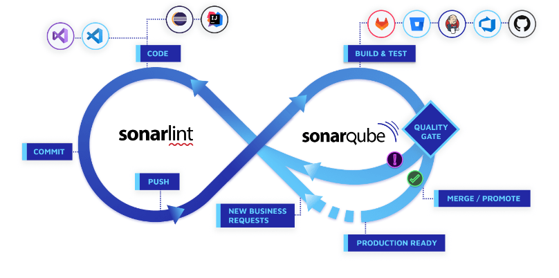

= Sonarqube

== Was ist Sonarqube

Sonarqube ist eine self-managed Review-Software, dass heißt man muss es selbst hosten.

=== Docker

Sonarqube kann auch lokal mittels Docker gehosted werden. Der Command dazu ist: `docker run -d --name sonarqube -p 9000:9000 -p 9092:9092 sonarqube`

=== Features

Sonarqube Analysiert den Code eines Projekts, dazu gehört das finden von:

* Redundanzen
* Angriffsstellen für Hacker
* Code-Coverage (wie gut ist der Code mit Unit-Tests etc. getestet)
* Bugs 
* Code Smells (Bad-Practices beim Programmieren)

== Sonar-Solution

Sonarlint ist ein Tool für direktes Feedback zu Fehlern, Bugs und stilistischen Unschönheiten (statische Code-Analysen)

In der Sonar-Solution gibt es außerdem die Möglichkeit Quality-Gates einzurichten, welche bspw. das mergen einer Pull-Request auf den Main-Branch verhindern, wenn einer oder mehrere Unit-Tests fehlschlagen.